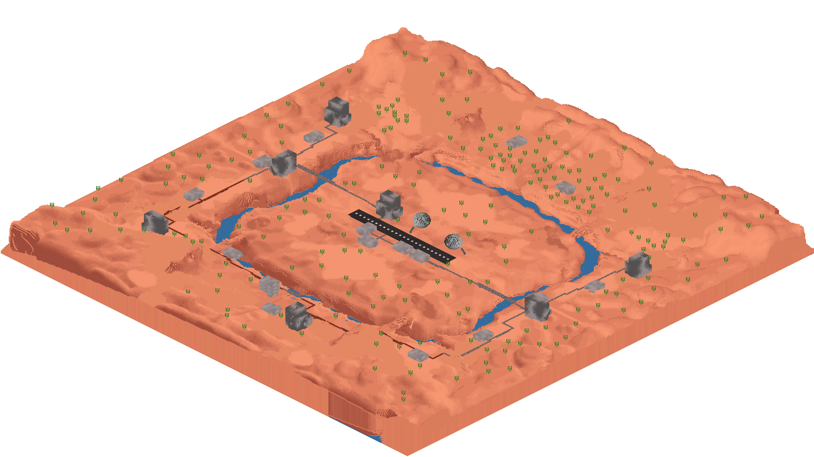

D-VXLMapPreview
===============

Snappy name, I know.

Generates isometric preview images of VXL and Icemap maps for Ace of Spades and Iceball.

Warning: This is my first D project, used as an excuse to try out the language.
The code is possibly broken and/or includes a lot of bad practices.

Usage
-----

    d-vxlmappreview --input=mesa.vxl --output=mesa.png
    d-vxlmappreview --input=mesa.vxl --output=mesa.png --background=0x333333
    d-vxlmappreview --input=mesa.vxl --output=mesa.png --background=0x000000FF
    d-vxlmappreview --input=mesa.vxl --output=mesa.png --transparent
    d-vxlmappreview -i mesa.vxl -o mesa.png

Building
--------

    dub build

TODO
----

 * The TODO comments in the source.
 * Allow use from Python somehow (build as C shared lib? pyd?)
 * Lighting?

Credits
-------

Based on (a fork of a fork of) [this script](https://gist.github.com/iamgreaser/4709760) by [iamgreaser](https://github.com/iamgreaser).

Makes use of [dlib](https://github.com/gecko0307/dlib).